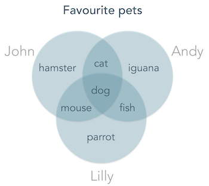
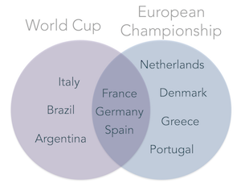
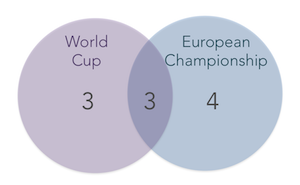
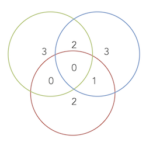
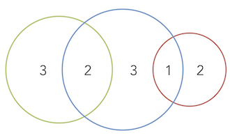
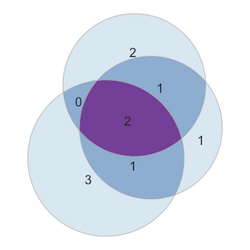

* [Venn and Euler diagrams](#intro)

* [Frequently Asked Questions](#FAQ)

  - [Can I use more than 3 sets?](#faq1)
  - [Are the circles and intersection areas in Euler diagrams exactly proportional to the number of elements?](#faq2)
  - [Empty intersections are still drawn!](#faq3)
  - [What happens when there are duplicate elements in the same set?](#faq4)
  - [Some shared elements between sets are not being recognized!](#faq5)
  - [The PDF file is different than what is displayed on the screen.](#faq6)
  - [Why does the error message 'Each set can contain more than 500'000 characters' appear?](#faq7)
  - [The slider wiggles back and forth automatically.](#faq8)

# Venn and Euler diagrams

### Venn diagrams
Venn diagrams are an excellent way to visualize and analyze relationships between different groups (sets).

In a typical Venn diagram, 2 or more sets (each containing various elements) are represented as circles overlayed onto each other. The elements shared between the various sets are represented at the respective circle intersections.
The Venn diagram above allows a quick and easy comparison of three sets and an immediate identification of shared or unique elements. This type of visualization can be much more effective than resorting to a list or table.

A common use for Venn diagrams is the identification of shared and unique elements in different sets. Even a relatively small dataset can be more conveniently displayed as a Venn diagram:

<table style="margin-left:30px; margin-bottom:30px">
<thead>
<tr>
<th style="text-align:center; padding:5px">World Cup</th>
<th style="text-align:center; padding:5px">European Championship</th>
</tr>
</thead>
<tbody>
<tr>
<td style="text-align:center">Germany</td>
<td style="text-align:center">Portugal</td>
</tr>
<tr>
<td style="text-align:center">Spain</td>
<td style="text-align:center">Spain</td>
</tr>
<tr>
<td style="text-align:center">Italy</td>
<td style="text-align:center">Spain</td>
</tr>
<tr>
<td style="text-align:center">Brazil</td>
<td style="text-align:center">Greece</td>
</tr>
<tr>
<td style="text-align:center">France</td>
<td style="text-align:center">France</td>
</tr>
<tr>
<td style="text-align:center">Brazil</td>
<td style="text-align:center">Germany</td>
</tr>
<tr>
<td style="text-align:center">Germany</td>
<td style="text-align:center">Denmark</td>
</tr>
<tr>
<td style="text-align:center">Argentina</td>
<td style="text-align:center">Netherlands</td>
</tr>
<tr>
<td style="text-align:center">Italy</td>
<td style="text-align:center">France</td>
</tr>
</tbody>
</table>

Notice that duplicate values in each set are counted as one (e.g. Germany appears two times in the World Cup set and once in the Euro set, but only once in the Venn diagram).

It is common to represent only the number of elements in each Venn diagram region, rather than to enumerate all the elements (this is essential for larger datasets).

### Venn diagrams and Euler diagrams

In a classical Venn diagram, the size of all circles is equal and all possible relationships are displayed (even if there are no elements in common between some sets):

In contrast, <a href="https://en.wikipedia.org/wiki/Euler_diagram" target="_blank"> Euler diagrams</a> can be used to represent only the existing relationships between sets, by redrawing and moving the circles around. This is often more visually appealing and easier to understand than a regular Venn diagram:

### Geometric constraints
Typically, the areas of Eulerian circles and intersections attempts to represent the size of the respective sets. However, geometric contraints often make this impossible to achieve (particularly when using symmetric circles / ovals). Therefore, in many cases we will be left with a representation of overlaps that do not contain any elements:

---

## Frequently Asked Questions

###  Can I use more than 3 sets?

No, you can only compare 2 or 3 sets. Comparing 4 or more sets requires the use of more <a href="https://en.wikipedia.org/wiki/Venn_diagram#Extensions_to_higher_numbers_of_sets" target="_blank"> exotic geometries</a>, which are currently not available at VennDiagrams.net

### Are the circles and intersection areas in Euler diagrams exactly proportional to the number of elements?
No, they are not. In some cases even empty intersections will be drawn. See the discussion on Euler geometry contraints above.

### Empty intersections are still drawn!
See above.

### What happens when there are duplicate elements in the same set?

An element in a set is only counted once. See the  World Cup and European Championship example described above.

### Some shared elements between sets are not being recognized!

Check your spelling carefully. In particular, check if there are no spaces after each name (eg. 'Apple' is different from 'Apple ').

### The PDF file is different than what is displayed on the screen.

This is a common issue with the rendering of vectorized vs rasterized images (e.g. PDF and PNG). First, use the size option get a better PDF. You can also adjust the line width and font size parameters ('Options' menu) until you get a better pdf image. Another option is to simply download the plot as a PNG file.

### Why does the error message 'Each set can contain more than 500'000 characters' appear?
The maximum number of characters that can be used to define each set is 500000 (including line breaks). So if each of your elements has 9 letters, you can have a maximum of 50 thousand elements per set.

### The slider wiggles back and forth automatically.
This occasionally happens when you are faster than the server or your internet connection :) Just close the dialog and wait a couple of seconds and it will be functional again.

<a style="color:lightgrey;" href="http://www.nunopires.net" target="_blank"> 2017 | Nuno Pires </a>
